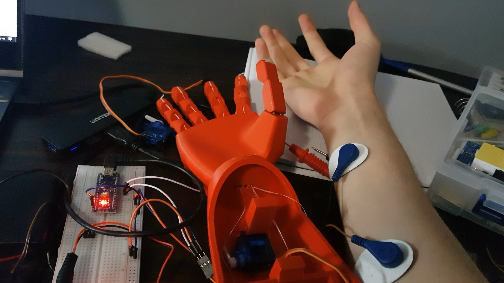

# emg_prosthetic_hand
An EMG-controlled prosthetic hand.

This repo contains the code used to build this prosthetic hand:

</img>

The physical body of the prosthetic hand is 3D printed (mechanically, it's relatively simple). The position of the fingers is controlled by servo motors inside the hand. The servo motors are controlled by an arduino. Electrodes are attached along the forearm to get an EMG signal that is used to determine whether the hand is open or closed.

`emg_control.py` acquires an EMG signal and processes it to determine whether the hand is open or closed, then sends commands to an arduino to replicate that behaviour on the prosthetic. This uses the `neurol` python package which can be found here: github.com/Awni00/neurol

`control.ino` is the arduino file to control the servos in order to open or close the prosthetic hand.